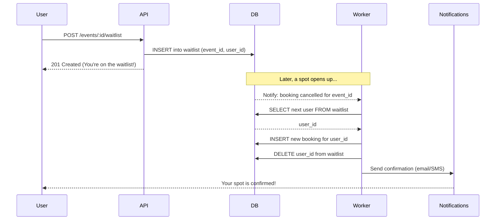
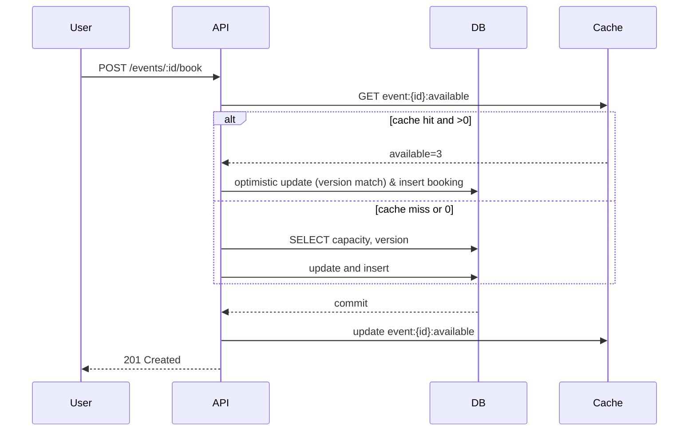

# System Design — Quorix

This document explains the architecture and design considerations for Quorix: Event booking notification tem. It covers concurrency, database design, scalability, API design, optional enhancements, and includes Mermaid diagrams for key flows.

---

## High-level architecture

- FastAPI for HTTP API endpoints.
- SQLAlchemy (async) + Alembic for persistence and migrations.
- Postgres (recommended) as the production relational store.
- Redis for caching and as Celery broker/result backend.
- Celery for background tasks (email notifications, waitlist promotion, analytics batching).

````mermaid
%%{init: {'theme': 'black'}}%%
flowchart LR
    %% System Design — Quorix: Event Booking Notification System

    subgraph User Interaction
        Client
    end

    subgraph Backend Services
        API[FastAPI]
        Broker[(Celery Broker/Redis)]
        Worker[(Celery Worker)]
    end

    subgraph Data Stores
        DB[(Postgres)]
        RedisCache[(Redis Cache)]
    end

    subgraph External Services
        Notifications[Email/SMS Service]
    end

    Client -->|HTTPS Request| API
    API -->|Read/Write| DB
    API -->|Cache Lookups| RedisCache
    API -->|Enqueue Task| Broker
    Broker -->|Distribute Task| Worker
    Worker -->|Update DB| DB
    Worker -->|Send Notification| Notifications
````

---

## Concurrency & Race Conditions

`Problem: Multiple users may try to book the last remaining seats concurrently. Without proper controls, overselling can occur.`

Techniques to prevent oversell:

- Optimistic locking

  - Add a `version` column to the `events` table (integer). On update, include `WHERE id = :id AND version = :version`. If 0 rows are updated, retry (read latest, detect conflict) or report failure.
  - Pros: low locking overhead, good for high-read workloads.
  - Cons: requires retry logic in application code; heavy contention leads to more retries.

- Database transactions with SELECT ... FOR UPDATE (pessimistic locking)

  - Start a transaction, select the event row with `FOR UPDATE`, check remaining capacity, insert booking, decrement capacity, commit.
  - Pros: simple to reason about and reliable when capacity changes are frequent.
  - Cons: locks reduce concurrency; long transactions can lead to contention.

- Queues / Serializers
  - Push booking requests to a `single- or sharded-queue`; workers process requests sequentially per event or per partition key (e.g., event_id). This serializes booking operations and eliminates race conditions.
  - Pros: deterministic, easy to scale by sharding across events.
  - Cons: increases write latency; requires queue infrastructure.

Recommended approach for Quorix (production-ready):

Indexes:

- `events(start_time)`, `events(organizer_id)`
- `bookings(event_id)` composite index on `(event_id, status)` to quickly compute active bookings
- `waitlist(event_id, position)`

Constraints:

- Foreign keys to enforce referential integrity
- Unique constraints where applicable (e.g., only one active booking per user per event if required)

---

## Scalability

Handling thousands of concurrent bookings:

- Horizontal API scaling

  - Run multiple FastAPI instances behind a load balancer. Keep API stateless; store state in DB/Redis.

- Database scaling

  - Primary/replica for read scaling. Writes must go to primary.
  - Use partitioning/sharding for events if a single table gets massive.
  - Use connection pooling (psycopg + asyncpg) and tune pool sizes.

- Caching

  - Cache read-heavy endpoints (event details) in Redis with short TTLs.
  - Cache computed available seats but always validate at booking time against authoritative DB state to avoid oversell.

- Rate limiting and throttling

  - Protect endpoints with rate limits per IP and per user.
  - For flash-sales, employ queueing to avoid overwhelming DB.

- Other choices
  - Use a queue per event (or per shard) to serialize writes under extreme contention.
  - Use a write-optimized datastore (e.g., specialized counters) if only counts are needed and eventual consistency is acceptable.

---

## API Design

Principles

- RESTful endpoints using clear resource paths and HTTP verbs.
- Use proper status codes (201 created, 409 conflict on capacity conflicts, 400 bad request, 401/403 for auth errors).
- Paginate list endpoints.

Example endpoints

- GET /api/v1/events
- POST /api/v1/events (create event)
- GET /api/v1/events/{event_id}
- POST /api/v1/events/{event_id}/book
- POST /api/v1/events/{event_id}/waitlist
- DELETE /api/v1/bookings/{booking_id}

Error handling patterns

- Return structured JSON errors: {"code": "capacity_conflict", "message": "Event is fully booked"}
- For optimistic lock failures, return 409 with info to retry.

---

## Optional Enhancements (Stretch Goals)

- Waitlist system

  - Users can join a waitlist when event is full. When a cancellation occurs, pop the first waitlist entry and notify the user.
  - Implementation: stored in `waitlist` table with position; promotion handled by a Celery worker.

- Seat-level booking

  - Model seats separately (seat map table) and lock seats on selection.

- Notifications

  - When waitlist promotion occurs, send email/SMS and reserve seat for the user for a short TTL; if they don't accept, move to next.

- Advanced analytics
  - Periodic batch jobs aggregate booking stats and store them in a data-warehouse table for fast reporting.

---

## Example: Waitlist promotion flow (Mermaid sequence)



---

## Engineering notes & tradeoffs

- Optimistic locking + retries gives high throughput but requires robust client retry handling. Use a small retry cap and fall back to queueing for high contention events.
- Pessimistic locks are simpler but will reduce concurrency under heavy load.
- For analytics and reporting, use dedicated batch jobs and separate read-optimized stores to avoid impacting transactional DB performance.
- Consider eventual consistency for counts/analytics where strict real-time accuracy is not required.

---

## Diagrams

### Booking request sequence (simplified)



---
