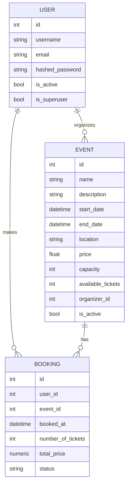
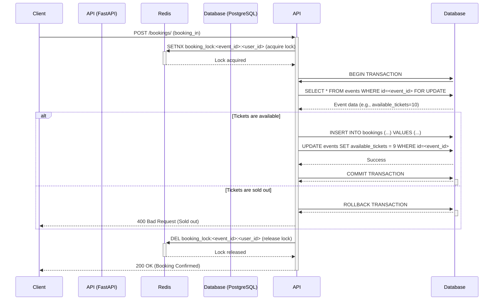
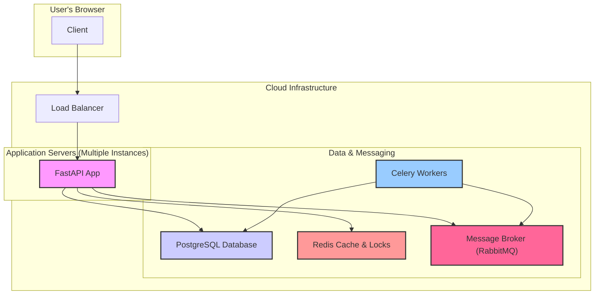

# Backend Architecture & Design Decision

**Author:** Backend Engineer (Jagan Kumar Hotta)
**Version:** 1.0
**Date:** 2025-09-15

## 1. Introduction

This document outlines the backend architecture for the Quorix platform. As the backend engineering guy,my primary goal was to build a system that is not only functional but also highly scalable, resilient, and maintainable. We anticipated high-traffic scenarios, especially during ticket sales for popular events, and made specific design choices to handle these challenges gracefully.

This document details our approach to three critical areas:
- **Database Design:** Modeling our data for integrity and performance.
- **Concurrency Control:** Solving the classic race condition problem of overselling tickets.
- **Scalability & Fault Tolerance:** Ensuring the system remains fast and responsive under load.

---

## 2. Database Design

A solid database schema is the foundation of a reliable application. We designed our models to be normalized, ensuring data integrity while using extensive indexing to guarantee performance.

### 2.1. Data Models

Our core models are `User`, `Event`, and `Booking`.

- **User:** Represents both event organizers and attendees.
- **Event:** Contains all details about an event, including its total `capacity` and the number of `available_tickets`.
- **Booking:** A transactional record linking a `User` to an `Event`, detailing the number of tickets purchased and the status of the booking.

The relationship between these models is visualized in the Entity-Relationship (ER) diagram below.

### 2.2. Integrity and Performance

- **Data Integrity:** We enforce integrity using foreign key constraints. For example, a `Booking` cannot be created without a valid `user_id` and `event_id`. This prevents orphaned records in our database.
- **Performance through Indexing:** We made a conscious decision to index columns that are frequently used in `WHERE` clauses, `JOIN` operations, and `ORDER BY` clauses. In `app/models/event.py` and `app/models/booking.py`, you will see not only standard single-column indexes but also **composite indexes** (e.g., `idx_event_date_location`). These are crucial for optimizing complex queries that filter on multiple attributes, ensuring our API remains fast as the dataset grows.

---

## 3. Concurrency & Race Condition Handling

The most critical backend challenge for an event platform is preventing overselling. If two users try to book the last available ticket at the exact same moment, a naive implementation would sell the ticket to both, leading to a negative customer experience.

We implemented a multi-layered defense to make our booking process robust and consistent.

### 3.1. The Booking Process Flow

The following sequence diagram illustrates the steps involved when a user requests to book a ticket.

### 3.2. Concurrency Handling Techniques

1.  **Distributed Locking (Redis):** Before initiating the booking, the application acquires a distributed lock using Redis (`SETNX` command). This lock is unique to the event and user. This is our first line of defense, preventing a single user from accidentally sending multiple simultaneous requests and creating duplicate bookings. It also serves as a gatekeeper in a distributed environment where multiple instances of our application are running.

2.  **Atomic Database Transactions:** The entire booking logic in `create_booking_atomic` is wrapped in a database transaction. This ensures that all database operations—reading the event, creating a booking, and updating the ticket count—are treated as a single, indivisible unit. If any part of the process fails, the entire transaction is rolled back, leaving the database in a clean, consistent state.

3.  **Pessimistic Locking (SELECT FOR UPDATE):** This is our most powerful guarantee against race conditions. Within the transaction, when I read the event's data, we use a `SELECT ... FOR UPDATE` statement. This tells the database to place a lock on the selected `event` row, preventing any other transaction from reading or modifying it until the current transaction is complete. While one transaction is holding the lock, any other transaction attempting to book a ticket for the same event will be forced to wait.

### 3.3. Trade-Offs

I chose a pessimistic locking strategy over an optimistic one.
- **Optimistic locking** (e.g., using a version number) would involve checking if the data has changed before committing. It assumes conflicts are rare.
- **Pessimistic locking** assumes conflicts are likely (which they are during a popular ticket drop). While it can slightly reduce throughput because transactions have to wait, it provides the strongest guarantee of consistency. For a critical operation like booking, we decided that **correctness and consistency are more important than raw throughput.**

---

## 4. Scalability & Fault Tolerance

Our architecture is designed to handle thousands of concurrent users.

Key choices for scalability include:

- **Asynchronous Architecture:** We chose **FastAPI**, which is built on `asyncio`. This allows this application to handle a large number of I/O-bound operations (like waiting for database queries or external API calls) concurrently without blocking. This is far more memory-efficient than a traditional synchronous, thread-based framework and is ideal for handling many simultaneous booking requests.

- **Background Task Queues (Celery):** Long-running or non-critical tasks are offloaded to a background worker. For example, when a booking is confirmed, we don't make the user wait while our server talks to an email provider. We immediately confirm the booking and delegate the email-sending task to a **Celery worker** via a message broker. This keeps it's API response times low and improves fault tolerance—if the email service is down, the task can be retried later without affecting the user's booking.

- **Caching (Redis):** In addition to locking, we use Redis as a cache. Details for popular events that are read frequently can be cached in Redis to reduce the load on our primary PostgreSQL database, improving read performance across the application.

- **Database Sharding:** While not yet implemented, our use of integer IDs and a clean separation of concerns in the data model would allow for future scalability through database sharding if the platform grows to an enormous scale.

## 5. Creative Features & Optimizations

- **Waitlist Functionality:** Instead of simply telling users an event is "Sold Out," we implemented a `Waitlist` feature. If a user tries to book a sold-out event, they are invited to join a waitlist. If another user cancels their booking (freeing up tickets), a background process automatically converts waitlisted users into confirmed bookings. This improves user engagement and maximizes potential event attendance and revenue.

- **Dedicated Concurrency Manager:** It encapsulated all the complex locking and concurrency logic into a `BookingConcurrencyManager` class. This makes the code cleaner, easier to test, and isolates this critical functionality in one place.
